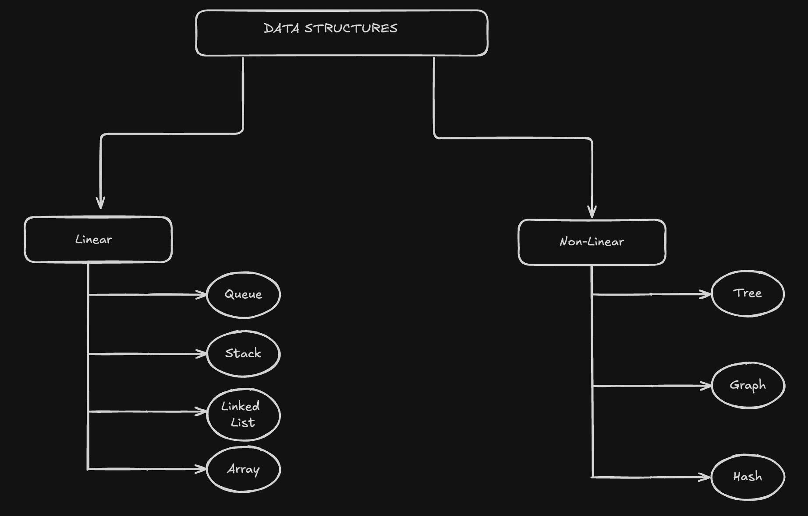

# Data Structures

  

## Array & Slice

An array is a data structure that holds a fixed number of elements, all of the same type. These elements are stored in contiguous memory locations and can be accessed directly using an index. The size of an array is defined when it is created, and it cannot be modified later. Because all elements must be of the same data type, arrays are ideal for situations where uniformity and predictable memory usage are important

While arrays must have a fixed size, the size of a slice can be dynamically adjusted. In Go, slices are more commonly used than arrays.

## Stack

A stack operates on the LIFO (Last In, First Out) principle, meaning the last item added is the first to be removed. The push operation adds a new item to the top of the stack, while the pop operation removes the most recently added item from the top. A stack is often compared to a stack of plates; when adding a plate, you place it on top, and when taking one to wash, you remove the topmost plate.

## Queue

A queue operates on the 'First In, First Out' (FIFO) principle, meaning the first item added is the first to be removed. It can be compared to a line of people waiting in front of a bakery; the person who joined the line first will always be the first to get the bread. The enqueue operation adds a new item to the end of the queue, while the dequeue operation removes an item from the front.

  
## Linked List

A Linked List is a dynamic data structure that stores a sequence of elements. Each element, or node, contains two parts: the data itself and a pointer to the next node in the sequence. This allows the elements to be stored in different locations in memory, yet they remain connected through these pointers, forming a list.

The list is managed by a Head pointer, which points to the first element, and often a Tail pointer, which points to the last element. A Linked List can grow or shrink dynamically as elements are added or removed.

Unlike arrays, where accessing an element requires knowing its index, in a Linked List, you must start at the Head and traverse the nodes sequentially to find a specific element, resulting in a time complexity of O(n). However, Linked Lists are particularly efficient for operations like inserting or removing elements at the beginning or middle of the list, as these operations only require updating a few pointers rather than shifting elements as in an array. The last node in a Linked List typically points to nil or null, indicating the end of the list.

## Tree

A tree is a hierarchical data structure consisting of nodes, where each node can have child nodes. The topmost node is called the root node, and the nodes beneath the root are referred to as subtrees. The distance of a node from the root is known as its depth.

Trees are commonly used for searching operations.

 
**Types of Trees:**

**Binary Tree:** Each node can have at most two child nodes.

**Binary Search Tree (BST):** A specialized form of a binary tree, where the left child nodes are smaller than the root node, and the right child nodes are larger.

**AVL Tree:** A self-balancing binary search tree where the difference in height between the left and right subtrees of any node is no more than 1.

**B-Tree:** A type of tree commonly used in database systems, capable of storing multiple child nodes.

**Trie (Prefix Tree):** Often used for efficiently storing and searching words or sequences.

  

## Graph

A graph is a data structure composed of nodes (vertices) and the connections (edges) between them. It is used to model relationships between nodes.

**Applications:**

**Social Network Applications:** Graphs are used to model relationships between users.

**Transportation Networks:** They can represent roads between cities, flight routes, or network connections.

**Computer Networks:** Graphs are used to model the structure of computer networks.

**Molecular Structures:** Graphs can represent atoms and their bonds within a molecule.

**Types of Graphs:**

**Undirected & Directed Graphs:** Graphs are categorized based on whether the edges have a direction. In directed graphs, edges have a direction indicating the relationship flows from one node to another, while in undirected graphs, the relationships are bidirectional.

**Weighted Graphs:** These graphs have edges assigned with weights that represent values such as distance, cost, or capacity, adding an additional layer of information to the connections.

**Graph Representation Methods:**

**Adjacency Matrix:** This is a square matrix used to represent a graph. The nodes are represented as rows and columns, and the matrix cells contain values indicating whether an edge exists between the nodes. If two nodes are connected, the corresponding cell in the matrix will have a value of 1; otherwise, it will have a value of 0. This method is straightforward but can be memory-intensive for large graphs.

  

**Adjacency List:** An adjacency list is a more flexible and space-efficient way of representing a graph. It stores a list of nodes that each node is connected to. This method is particularly useful for representing sparse graphs, where the number of edges is much smaller than the number of possible connections.

## HASH

A hash table is used to store key-value pairs, providing an efficient way to add and remove data based on keys. It involves using a function or algorithm to map data to a representative integer value.

  

An item is converted into an integer using a hash function. This integer can then be used as an index to store the original item in the hash table. The item is stored in the hash table using this hash key, allowing for quick retrieval.

**Collision Handling:**

Two different keys might generate the same hash value, leading to a collision. To resolve this issue, a method called separate chaining can be used. This method allows multiple items to be stored at the same index. Each index in the hash table holds a pointer to a linked list, which stores the items. This linked list is referred to as a bucket, and it ensures that all items with the same hash value can be efficiently stored and retrieved.

